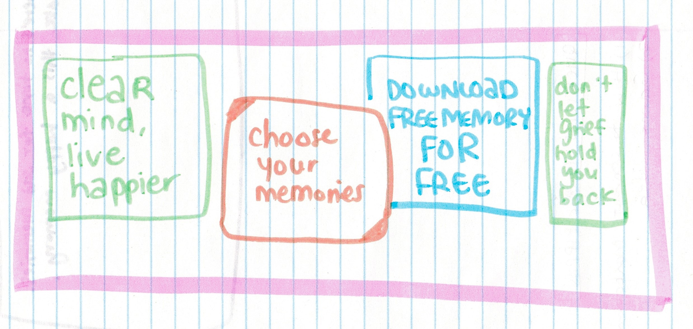
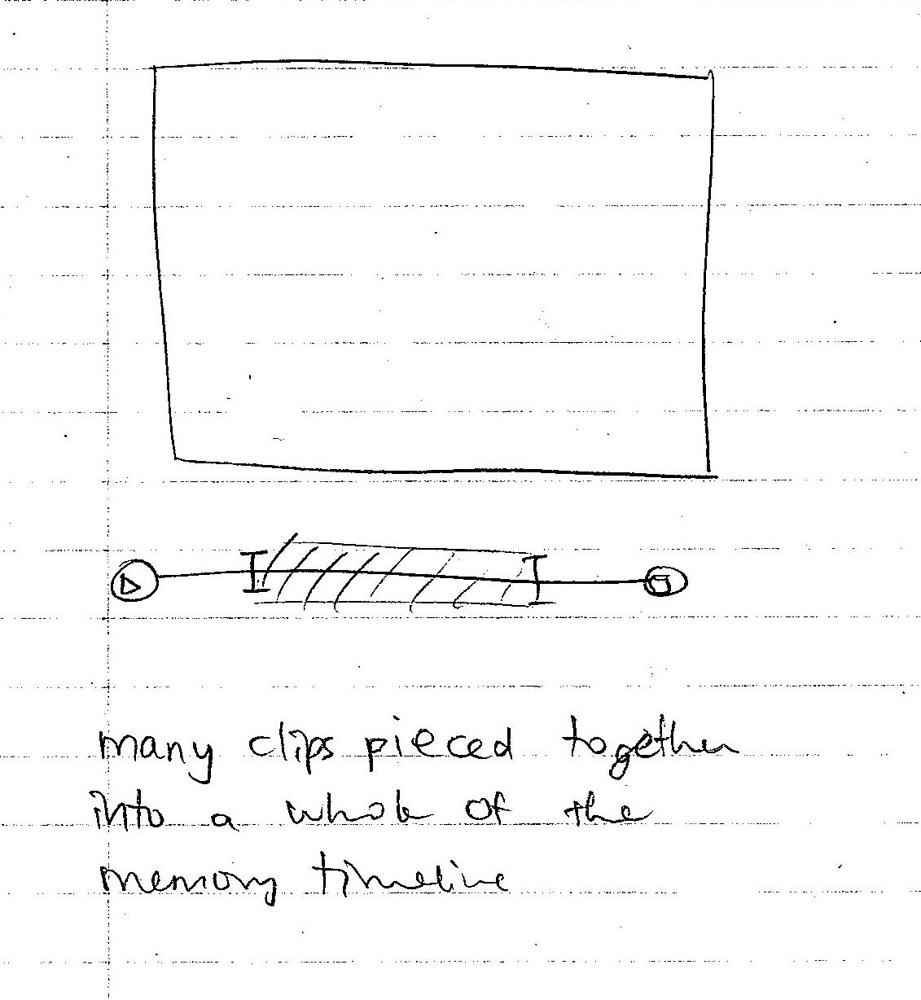
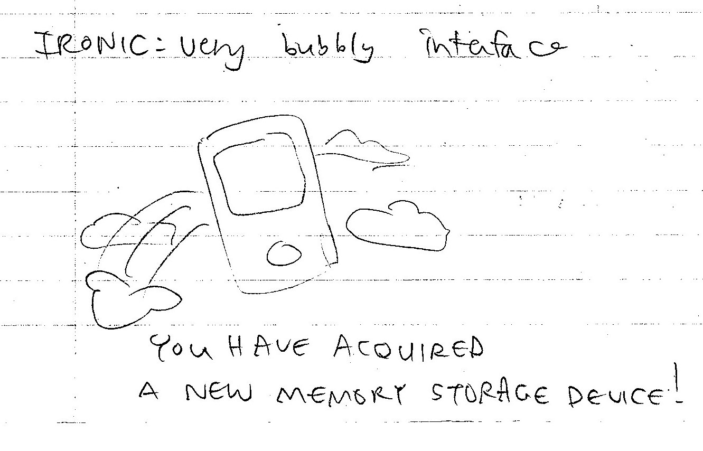
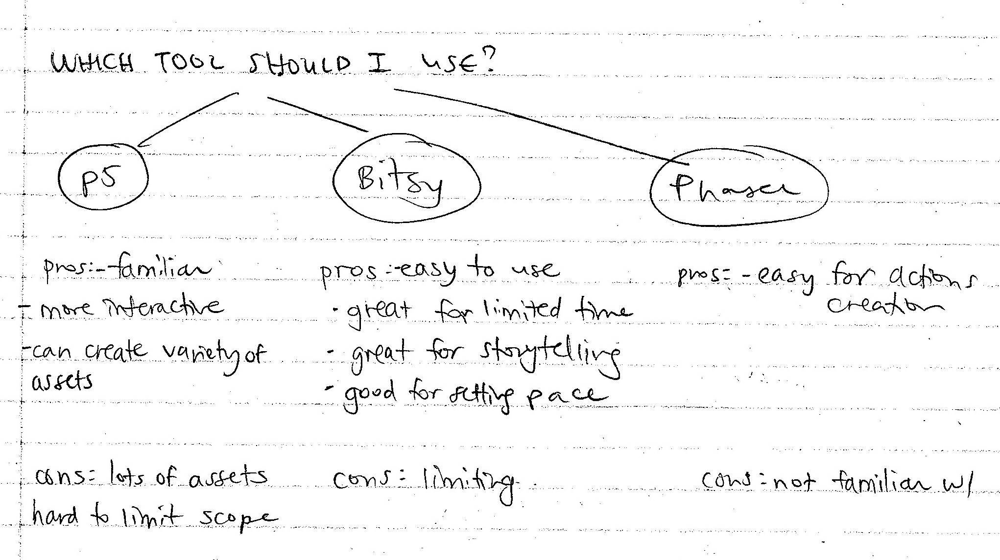
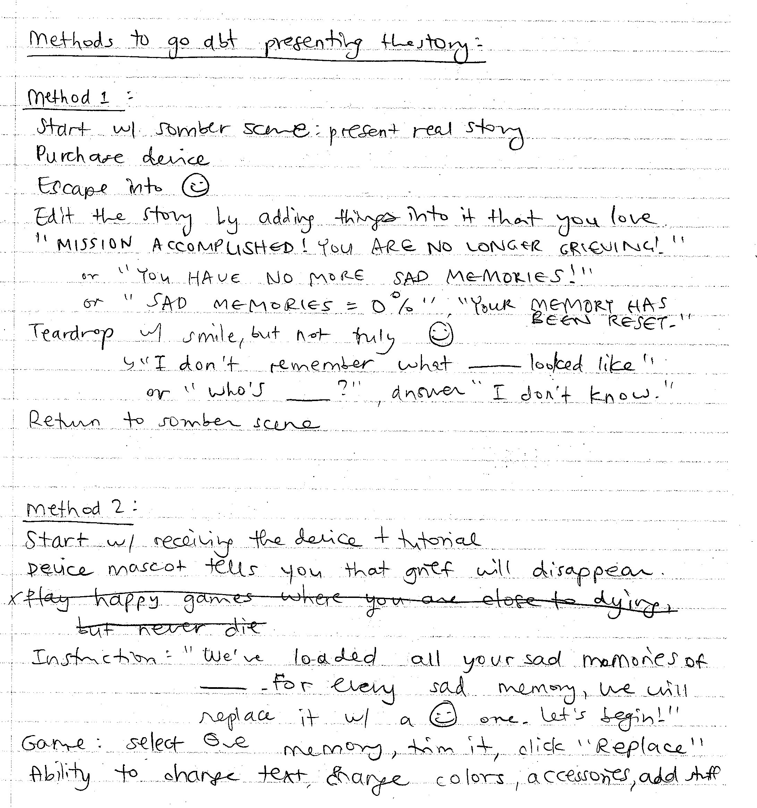
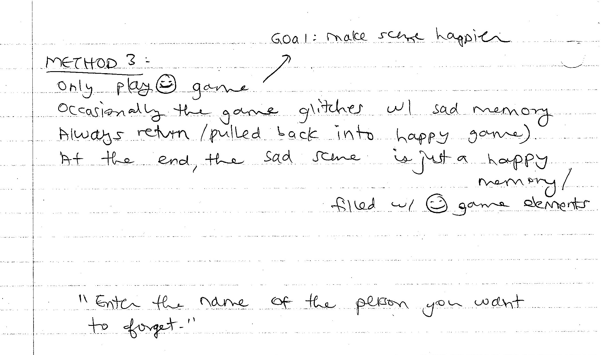
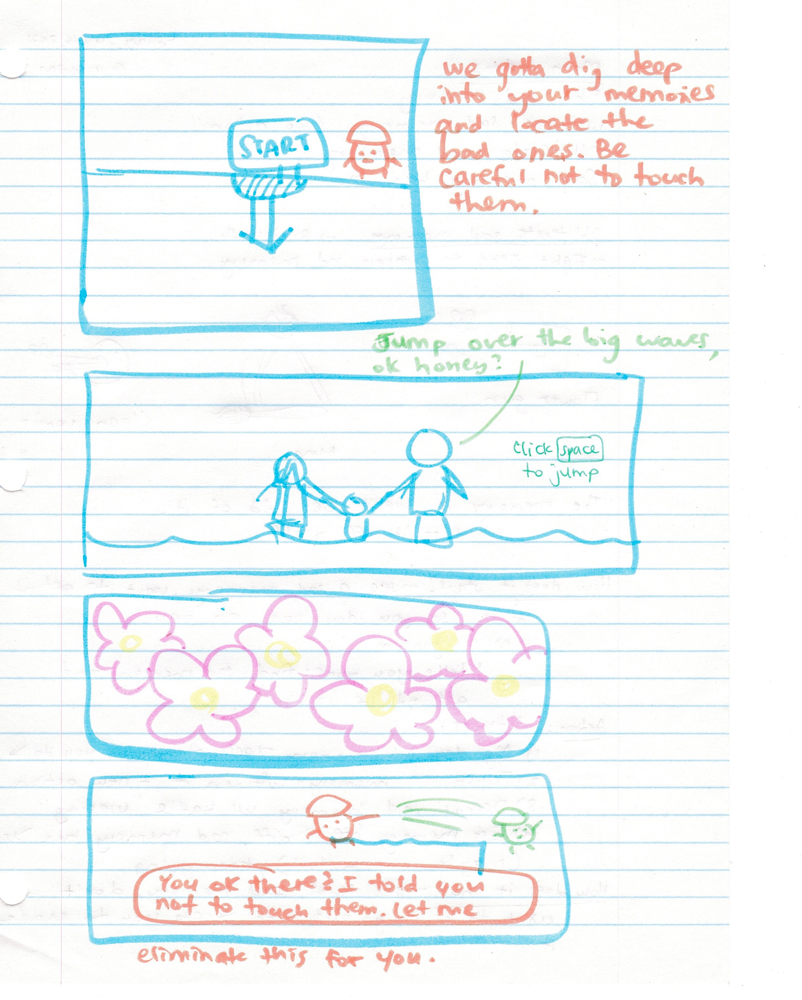
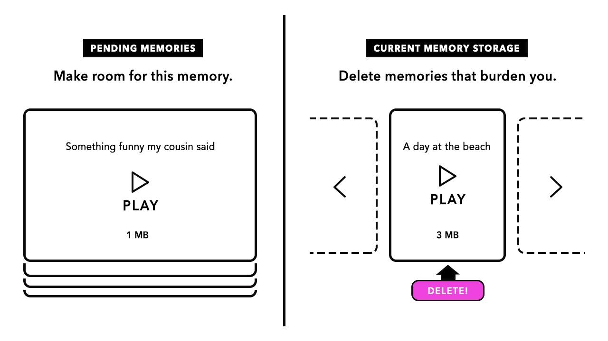
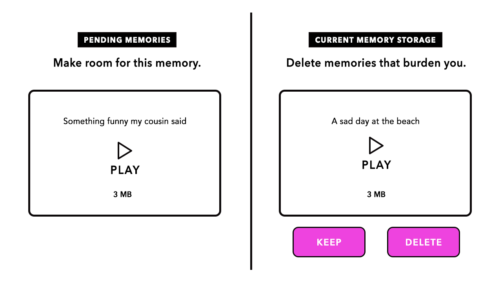

# Process Journal

This journal teleports you into the behind-the-scenes of my game-making process (welcome!👋).

I like documenting my thoughts using a mix of writing ✏️ and sketches 🖍️.

I have approximately two months to create a game that combines speculative play and the theme of death.

## Schedule

To orient myself, I created this rough schedule of things to do per week: 
(and yes, I start counting my weeks as of Saturdays)

JULY:

1. **July 7-9:** presentation of theme, brainstorm ideas
2. **July 10-16:** brainstorm ideas
3. [⭐ we are here] **July 17-23:** research and solidify game concept, start prototyping idea, create assets
4. **July 24-30:** code, create assets

AUGUST:

1. **July 31 - Aug 6:** code
2. **Aug 7-13:** code, conduct midway playtest with team
3. **Aug 14-20:** code
4. **Aug 21-27:** code, tidy up
5. **Aug 28-31:** refine, conduct final playtests

## Wednesday, July 7, 2021, at 4pm-ish

### Jotting down ideas, theme of death

Fear of death

Resuscitate a dying plant by rewinding time

"I had a dream the other day." 
"Yeah? What was it about?" 
"It was about this box." 
... 
(visiting the dead through a dream? dream contains a physical box that stores keepsakes of the dead)

When death becomes too much of a burden to handle, you have the option to forget about a person. 
A game where we have the choice to forget about a loved one who passed away

Trying desperately to preserve death 
A game for people who are unable to accept death --> choice of adding time to a life or freeze a moment

## Monday, July 12, 2021, sometime at night

I hate goodbyes. I hate saying goodbye to someone I love and never seeing them again. It's a suffocating feeling.

---

A snow globe that carries your memories of a loved one who passed away. Shattering into pieces. Memories lost forever.

That was the initial idea I had in mind. I imagined a world where memories are selective. There is only so much memory one can store and tolerate. Some memories make us stronger, some we need to let go of.

Grief is _not_ a memory worth storing. To help people get over their grief, this world allows each person to preserve their memories of the dead for 5 years in a snow globe-looking device. That's the amount of time needed to get over the grief. Afterwards, the memories are gone for good.

"Sorry, your storage has expired. The device and all its constituent memories will self-destruct in 5 minutes."

So maybe I can present a scene where you witness a cherished memory being erased?

Ultimately, I want my game to show how grief is not necessarily worth destroying. And show how memories of the dead don't need to be thought of as sad.

---

### Project goals

I still haven't worked out how I want the game to play out. But I have some goals in mind:

- I want my game to involve storytelling in some way.
- I want my game to be sad.
- I want my game to evoke the feeling of loss, not so much with the departed person, but rather with the lost memories.

---

### Brain storms/hurdles I need to overcome

I can't pinpoint what kind of game I want to create:

- a storytelling game made with p5, or a Bitsy game?
- should my game be driven by text or visuals?

---

### Phone instead of snow globe

I spoke to a friend about my idea. He said maybe instead of using a snow globe, the device can be a phone. And the person can choose to erase the memories whenever they want to. He also showed me a two-minute clip of Men in Black, where the spy people flashed a flashlight thingamabob into other people's eyes and reset their memories (please excuse me if I'm getting the plot wrong, I never watched the movie).

I liked the idea of swapping the snow globe with a phone. The device's functions appear more concrete. I can create an interface with play and trim functions, as well as the ability to rewind the memory like a video. But this also poses other problems, like how do I present these memories (with limited time, I won't be able to draw out numerous scenes)? Or how do I tell a story with the interface and convey feelings of loss?

I need to rework this idea.

## Thursday, July 15, 2021, at 10:30am

I feel like my brain is a jumble of thoughts. I have this one idea that I am set on: obliterating grief through memory manipulation. For the rest, I had to sort out my thoughts with writing and sketches.

### Speculative world

This is a world where memory is selective, so maybe storefronts can feature posters that hint at the normalcy of people having the choice to select their memories?

---

### Sketches on the game's look

Either I can create a video editing tool, where the video is the memory...

Or I can present a very bubbly interface, which is ironic since the theme is death.

I like the bubbly interface approach because (1) it fits my art style, and (2) it contrasts nicely with death.

Alrighty, with one decision out of the way, let's tackle the other 99.

---

### Choosing a technology to use

Weighing the pros and cons, no decision yet

---

### Reflecting on how to tell the story

Methods of presenting the story:

Questions to ponder on:

- Does the player know the story is about the dead?
- Does the cute look interfere with the sad storytelling?

---

### New idea! Game action

What if one of the actions is to dig deeper into the network of memories to isolate the sad ones?

Then once you capture the sad memory, you toss it into the abyss?

I have to sketch this out:

What I drew:

1. Digging for sad memories, app character (orange potato character) guides you
2. Say you captured a sad memory, it plays the memory of you spending time with the loved one
3. Fades into flowers (bubbly interface of the app)
4. App character tosses sad memory (green character) off a cliff

## Friday, July 16, 2021, at 4:07pm

I had some time to solidify my thoughts.

### Game idea in one sentence

Player uses an app called "Memorywash" to delete memories of the dead and eliminate the feeling of grief

---

### More deetz on actions

1. In the app, you keep digging into your memories

2. When you touch a sad memory (personified as a character), you get sucked into it and watch it play out

3. When memory is done playing, you beat up the sad memory character in a battle --> brainwashing and elimination process

4. After defeating memory, you toss it off a cliff, the sad memory bar goes down, then you repeat the process (will probably encounter about 2-3 memories in total)

In the end: you have relinquished all memories of the dead and regret that you chose to forget

---

### Aesthetics

Very happy and cute (ironic as you don't normally associate this with death)

Sad memory: blue character

When you get sucked into the memory, it starts off looking bleak but gets more colorful (showing that you are becoming more comfortable with confronting the memory)

---

### Fight actions against sad memory

Actions centered around the idea of washing (cleaning up the memory + brainwashing):

- Sprinkle with flowers
- Shoot rainbow rays

---

### Questions remaining:

- Is scope too large considering time limit?
- What are the 2-3 sad memories that I will present?
- How do I present those memories? Image? Text? Video?

## Sunday, July 18, 2021, at 11:32am

### Today's focus: Reflecting on the idea of play and storytelling approaches

I researched some game design methods by fetching out my old notes from [Prof. Enric Llagostera](https://enric.llagostera.com.br/)'s Intro to Game Design course. His lectures were filled with gems and helped to guide my design choices for this game.

Here are some of the notes I took:

---

### Playtesting

- Playtesting is important! (need to add this to my to-do list: make a playtesting schedule)

---

### Play:

- Play is **carnivalesque**. It seeks equilibrium between creation and destruction.
  - My game: character digs out/replays memories with the goal of destroying it.
- Play is **personal**, linked to our individual memories.
- Success is determined by how well the player plays the game.
  - A reminder to my game: if I create a good game, I can get the player emotionally invested in it.
- Think back to an experience I've had with a well-played game.
  - One game I really enjoyed playing is [Under a Star Called Sun](https://duckduckgo.com) by Cecile Richard. It also delves into the concept of grief, presenting it beautifully with storytelling, visuals, and music.
- Play is **disruptive** + breaks the status quo.
  - Guess this ties to the whole idea of speculative play. In my case, I'm reflecting on how manipulation of memory can be ruinous in the context of abolishing grief.

---

### Storytelling:

- Stories are connected to our **memories**.
- Stories can be told using a variety of in-game elements.
  - I want mine to use **images, setting, characters, and sound** as the main narrative elements:
    - Images: in presenting the Memorywash app interface, setting, etc. --> need to figure out how abstract I want these to be
    - Setting: the tunnel of memories (very cute), the memory setting (more emotional and relatable)
    - Characters: app mascot, main character, sad memory personified, characters within the memory
    - Sound: mix of happy and sad, piano playing
- I want to use stories **as a quest and as a choice**:
  - Player actions allow story to progress.
  - The story becomes a source of tension and experience.
- A thought I had: I can progress the story based on the kinds of memories that the player chooses to encounter.
  - This can be tied in with the action of digging into the memories. Digging is a process that leads to choice.
  - Ex of branching path: If you click A: a happy memory tugs at you, but you have to dig really deep to find it. If you click W: a really really sad force lingers nearby, drawing you in and overwhelming you.
- Branching structure: I want to go with a reconverging branching structure.
  - Why?
    - I want to conclude with 1 ending.
    - I want the player to choose between multiple memory paths along the way.
    - Less complicated than "shrub" structure, where there are too many paths.

---

### Reflections when designing game stories:

1. Why does this game/story matter?
2. Perspective: who is telling the story?
3. Storyboarding

## Tuesday, July 20, 2021, at 4:16pm

### A change in the idea

After sharing my game idea with Pippin, he gave me some points to reflect on.

1. The purpose of the battle mechanism: is it really essential?

2. A possible twist in the game direction

ENTER MISSING INFO HERE

---

### What is my game?

The player manages their memory storage using an app called "MemoryWash" that proposes what is trendy and worth keeping versus what is irrelevant and should be deleted ASAP. Heads up! Memories of the dead fit in the latter category.

---

### Photoshop mockup

Memories are stored in these cards. When you click "play," it shows you the memory. You can choose to delete it or scroll through the other memories to find one to delete.

MB = memorybytes

---

### Challenge

Math. I'm not sure how to create a system that measures the amount of memorybytes used.

If say a bad memory takes up 5MB while the happy ones take up 1MB, once you remove the bad memory, does the system automatically delete the 5 happy memories?

## Wednesday, July 21, 2021, at 2:22pm

### Notes about the mascot

The mascot of the app acts like a game show host. In fact, the whole app is designed to look like a game show:

"Which memory do you choose? One will die, the other will live on."

The mascot (representative of the system) has a voice that communicates its biased feelings. Tries to push you towards keeping the "trendy, happy" memories. Berates you for keeping "negative" memories.

---

### Photoshop mockup

Instead of showing multiple memory cards in the "current memory" pile, the system puts one pending memory against one bad memory.

This one-on-one placement of memories allows me to bypass the math challenge discussed yesterday. It also reduces the amount of decision-making that the player needs to do, which is great because they can focus more on the content of the memory instead of being overwhelmed by the abundance of choices.
